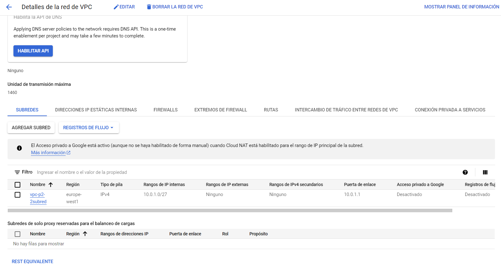
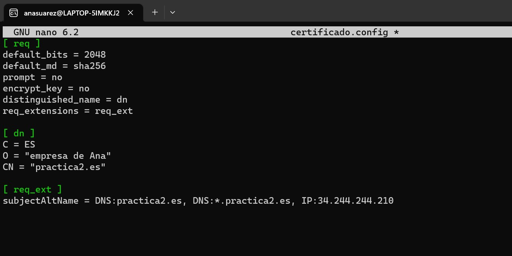
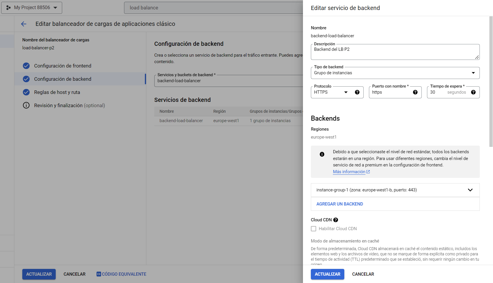
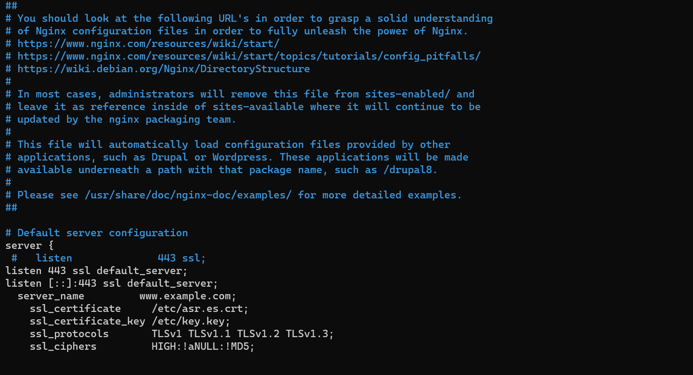

# Practica 2 ASR

## Primera Solución: Creación de la máquina de salto
En esta solución crearemos una máquina de salto, a través de la cual podremos acceder al servidor. Además, limitaremos el acceso a ambas máquinas configurando una serie de reglas de Firewall de nivel 4.
### Pasos a seguir:
1. Creamos la VPC Network "vpcp2" y le asignamos el rango de IP internas 10.0.0.0/27.
   

3. Creamos las dos instancias de VM, por un lado, la que es el servidor y por otro la que es la máquina de salto.
Ambas máquinas tienen dirección IP privada dentro de la subnetwork y dirección IP pública.

A continuación se incluyen las imágenes que muestran la configuración de las dos Máquinas virtuales, http-server y jump-server.

----------------------------------------------------------------------------------------------------------------------
#### Máquina http-server:
  

----------------------------------------------------------------------------------------------------------------------
#### Máquina jump-server:

 
----------------------------------------------------------------------------------------------------------------------

4. Para esta solución, habilitamos las siguientes reglas de Firewall:
   
   - 1. Se habilita el tráfico ssh desde la dirección IP de nuestro pc hasta el jump-server a través del puerto 22.
   - 2. Se habilita el tráfico interno, únicamente el tráfico TCP desde el jump-server al http-server.

 

Para permitir el acceso al jump-server desde nuestro pc hemos añadido la clave SSH en el "metadata" de Google Cloud. Una vez hecho esto y creadas las máquinas, ya podemos acceder al jump server desde nuestra consola de comandos. 

 
 
  

5. Para comprobar el acceso desde la web, habilitamos una tercera regla de Firewall con origen la IP de nuestro pc y con destino la IP pública de la máquina http-sever. En este caso a través del protocolo TCP por el puerto 80.

     

 De esta manera podemos acceder desde el buscador web al servidor:  
 

## Segunda solución: Introducción a los WAF - Web Application Firewall (firewall capa 7) - 4 puntos

Para la parte 2, lo primero que hacemos es crear de nuevo las máquinas virtuales, configurando una nueva subnet con los rangos de IP: 10.0.1.0/27.
En este caso, la máquina http-server solo tendrá dirección IP interna, mientras que la jump-server tendrá interna y externa. Para el acceso al servidor, instalaremos un Load Balancer de nivel L7 implementándolo con el servicio WAF y HTTPS offloading.

### 1. CREACIÓN DE LA SUBNET Y MÁQUINAS VIRTUALES
#### 1.1- Configuración de la subnet:

 

#### 1.2- Configuración de la máquina http-server:

 
#### 1.3- Configuración de la máquina jump-server:

 
### 2. CONFIGURACIÓN DE LAS REGLAS DE FIREWALL
Para este apartado, mantendremos la misma configuración que en el ejercicio anterior, por lo que al firewall de la nueva subnet creada le aplicamos las siguientes reglas:

#### 2.1-Permitimos únicamente el tráfico SSH desde el jump-server al servidor-http por el puerto 22:
 

#### 2.2-Permitimos también el tráfico SSH desde mi máquina al jump-server:
 

Con estas reglas habilitadas, podemos acceder al jump-server desde nuestra IP con el comando SSH para posteriormente acceder también al http-server desde el jump-server.

 

Sin embargo, para poder descargar los archivos en el http-server, tenemos que configurar el NAT para tener acceso a internet, ya que no tenemos IP pública en la máquina http-server.

### 3. CONFIGURACIÓN DEL NAT

#### 3.1-Habilitamos el NAT.

 
Una vez tengamos el NAT ya accedemos al Http-server e instalamos el Nginx.
 

A continuación, procedemos a configurar el Load Balancer.

### 4. CONFIGURACIÓN DEL LOAD BALANCER

#### 4.1-Generación del certificado:
En primer lugar, generamos el certificado a través de los comandos de SSL y lo cargamos en el servidor. El servidor web necesita estos documentos para poder firmar peticiones HTTPS.
 
  
#### 4.1-Configuración del balanceador L7:
Una vez tenemos el certificado cargado, procedemos a crear el balanceador de L7. Configuramos el Frontend y el Backend, que se configura con un grupo de instancias que debemos crear previamente.

##### 4.1.1- Creación grupo de instancias:
Nos creamos un grupo de instancias a las que se dirige el balanceador.

 

Además, en el backend, debemos crear un Health Check para asegurarnos de que el servidor está operativo. Este Health Check se realiza mediante una conexión TCP en el puerto 80.
 

 

#### 4.2-Health Check del Googel Firewall:
En este punto, también configuramos el Health Check de Google en el Firewall para permitir las comprobaciones desde ciertos rangos de IP externas a través del puerto 80.

 

De esta forma, una vez tenemos el balanceador creado, ya podemos acceder al servidor a través de Internet con la dirección IP del balanceador.

 

Si lo hacemos a través del buscador de Google, observamos que debido al tipo de CA que hemos utilizado, nos sale un aviso de seguridad.
 
 
  

#### 4.3-Configuración del WAF:
El objetivo de este apartado es proteger nuestra máquina de ataques SQL Injection, Cross-Site Scripting y restringir el tráfico solo a países de confianza de la UE implantando un WAF a nuestro balanceador.
Ahora procedemos a configurar el WAF a través de las políticas de Cloud Armor:

 

Las reglas instaladas son las siguientes:
 
---------------------------------------------------------------------------------------------------------------------------------------------------------------------------------------
**Preguntas apartado 2:**

¿Qué ventajas e inconvenientes tiene hacer HTTPS offloading en el balanceador?

- Ventajas: Reduce la carga en el servidor al encargarse el balanceador de gestionar las conexiones HTTPS y no el servidor final.
- Inconvenientes: Al deshabilitar el cifrado SSL/TLS en el servidor final, la comunicación entre el balanceador y el servidor no está cifrada, lo que podría hacer que el tráfico interno sea manipulado o interceptado. Se deben tomar medidas adicionales para proteger esta red interna.

¿Qué pasos adicionales has tenido que hacer para que la máquina pueda salir a internet y poder instalar el servidor Nginx?
He tenido que habilitar el NAT como router dentro de la red. La ruta se configura automáticamente.

## Tercera mejora solución: Zero Trust

En esta parte, buscamos que el contenido web esté cifrado también dentro del cloud.
La última parte consiste en hacer trabajar al Nginx por el puerto 443 y que el balanceador vaya también por el HTTPS en lugar del HTTP. Los pasos a seguir son los siguientes:

### 1. Modificar la configuración del instance group.
 
### 2. Cambiar la configuración en el Backend del Load Balancer para permitir la comunicación por el P443.

 

### 3. Modificar el Health Check del Load Balancer en el Backend para que se ejecute sobre el puerto 443.

 

### 4. Modificar la política de Health Check del Firewall para que se ejecute sobre el puerto 443.

 
### 5. Modificar la configuración de Nginx desde la consola del server para que trabaje sobre el puerto 443.

Para poder cambiar la configuración del Nginx dentro del servidor, debemos mover los archivos .cert y .KEY al http-server. Una vez tengamos estos archivos, debemos modificar la configuración del Nginx habilitando el parámetro ssl e indicando las rutas a los archivos .KEY y .crt.

  

Una vez modificada la configuración del Nginx, la actualizamos y la recargamos. Procedemos a conectarnos al localhost y nos sale un aviso de que no se reconoce el CA, por lo que no se puede abrir la conexión de forma segura. Ejecutamos el comando `curl -k https://localhost` para conectarnos de manera insegura, sin comprobar la autoridad del CA.
 
Finalmente, nos conectamos al `https://localhost`.

 
También podemos acceder desde el navegador.

 

## Cuarto apartado: Posibles mejoras

Otras posibles mejoras serían:

1. Monitoreo y Registro Avanzados: Utiliza herramientas para observar lo que sucede en la nube,que nos pueda ayudar a detectar cualquier actividad extraña o problemas de seguridad y mantener un registro de lo que ocurre. Por ejemplo utilizando un software de seguridad o servicios en la nube que registren y analicen lo que sucede en la red. 

Configuración de Backups y Restauración: Mantener copias de seguridad en caso de que ocurra cualquier problema. Se podrían programar copias periódicas y automáticas.

Implementación de Seguridad a Nivel de Aplicación: Utilizando software antivirus y antimalware por ejemplo.

Segmentación de Red Avanzada: Dividir la nube en distintas secciones para poder evitar que en caso de que una parte se dañe, también afecte al resto de la red.
